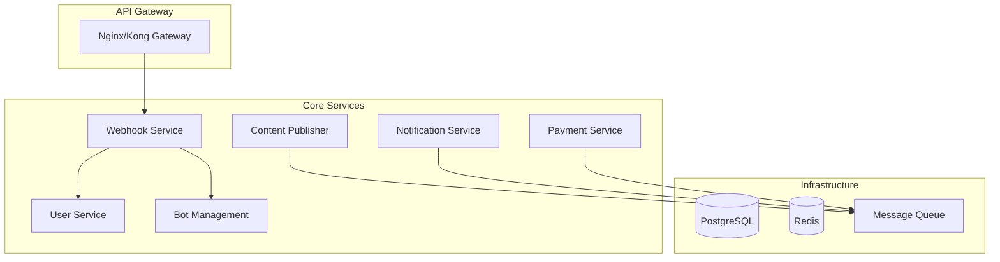

# План миграции Nova Bot на микросервисную архитектуру

## Текущее состояние системы

### Архитектурный анализ монолита
```
┌─────────────────────────────────────┐
│           МОНОЛИТ (main_api.py)     │
├─────────────────────────────────────┤
│ • Webhook handler                   │
│ • main_bot (основной функционал)    │
│ • hello_bot (дочерние боты)         │
│ • Schedulers (планировщики)         │
│ • Database layer                    │
│ • Payment providers                 │
│ • Telegram Client API              │
└─────────────────────────────────────┘
```

### Выявленные границы контекстов (Bounded Contexts)
1. **User Management** - управление пользователями
2. **Bot Management** - управление ботами пользователей  
3. **Content Publishing** - постинг и истории
4. **Payment Processing** - платежи и подписки
5. **Notification System** - планировщики и уведомления
6. **Webhook Gateway** - точка входа для webhooks
7. **Admin Panel** - административные функции

## Целевая микросервисная архитектура



## Пошаговый план миграции

### Этап 0: Подготовка инфраструктуры (1-2 недели)

#### 0.1 Настройка инфраструктуры
```bash
# 1. Добавить Redis для кеширования и очередей
docker-compose.yml:
  redis:
    image: redis:7-alpine
    ports: ["6379:6379"]
    volumes: ["redis_data:/data"]

# 2. Добавить Message Broker (RabbitMQ)
  rabbitmq:
    image: rabbitmq:3.12-management-alpine
    environment:
      RABBITMQ_DEFAULT_USER: nova_bot
      RABBITMQ_DEFAULT_PASS: ${RABBITMQ_PASS}
    ports: ["5672:5672", "15672:15672"]
```

#### 0.2 Создание базовой инфраструктуры микросервисов
```python
# shared/base_service.py
import asyncio
import signal
from abc import ABC, abstractmethod
import logging

class BaseService(ABC):
    def __init__(self, name: str):
        self.name = name
        self.logger = logging.getLogger(name)
        self.running = False
    
    @abstractmethod
    async def start(self):
        pass
    
    @abstractmethod
    async def stop(self):
        pass
    
    async def run(self):
        self.running = True
        self.logger.info(f"Starting {self.name}")
        
        # Graceful shutdown handling
        loop = asyncio.get_running_loop()
        for sig in [signal.SIGTERM, signal.SIGINT]:
            loop.add_signal_handler(sig, self._signal_handler)
        
        try:
            await self.start()
        except Exception as e:
            self.logger.error(f"Service {self.name} failed: {e}")
        finally:
            await self.stop()
    
    def _signal_handler(self):
        self.running = False
        self.logger.info(f"Shutting down {self.name}")
```

```python
# shared/message_bus.py
import aioredis
import json
from typing import Any, Callable

class EventBus:
    def __init__(self, redis_url: str):
        self.redis = None
        self.redis_url = redis_url
        self.handlers = {}
    
    async def connect(self):
        self.redis = await aioredis.from_url(self.redis_url)
    
    async def publish(self, event_type: str, data: dict):
        await self.redis.publish(
            f"event:{event_type}", 
            json.dumps(data)
        )
    
    async def subscribe(self, event_type: str, handler: Callable):
        self.handlers[event_type] = handler
        pubsub = self.redis.pubsub()
        await pubsub.subscribe(f"event:{event_type}")
        
        async for message in pubsub.listen():
            if message["type"] == "message":
                data = json.loads(message["data"])
                await handler(data)
```

### Этап 1: Выделение Webhook Gateway (неделя 1)

#### 1.1 Создание Webhook Service
```python
# services/webhook_gateway/main.py
from fastapi import FastAPI, Request
from shared.base_service import BaseService
from shared.message_bus import EventBus

class WebhookService(BaseService):
    def __init__(self):
        super().__init__("webhook-gateway")
        self.app = FastAPI()
        self.event_bus = EventBus("redis://redis:6379")
        self._setup_routes()
    
    def _setup_routes(self):
        @self.app.post("/webhook/main")
        async def main_webhook(request: Request):
            data = await request.json()
            await self.event_bus.publish("telegram.update", {
                "bot_type": "main",
                "update": data
            })
            return {"status": "ok"}
        
        @self.app.post("/webhook/{token}")
        async def user_bot_webhook(request: Request, token: str):
            data = await request.json()
            await self.event_bus.publish("telegram.update", {
                "bot_type": "user",
                "token": token,
                "update": data
            })
            return {"status": "ok"}
    
    async def start(self):
        await self.event_bus.connect()
        # Настройка uvicorn сервера
```

#### 1.2 Миграция webhook endpoints
1. Развернуть Webhook Service на порту 8100
2. Обновить nginx конфигурацию для проксирования webhook запросов
3. Постепенно перенаправлять трафик с main_api.py
4. Отслеживать логи и метрики

```nginx
# nginx/conf/nova.conf
upstream webhook_service {
    server webhook:8100;
}

location /webhook/ {
    proxy_pass http://webhook_service;
    proxy_set_header Host $host;
    proxy_set_header X-Real-IP $remote_addr;
}
```

### Этап 2: Выделение User Management Service (неделя 2)

#### 2.1 Создание User Service
```python
# services/user_service/main.py
from shared.base_service import BaseService
from shared.message_bus import EventBus
from database.user.crud import UserCrud

class UserService(BaseService):
    def __init__(self):
        super().__init__("user-service")
        self.event_bus = EventBus("redis://redis:6379")
        self.user_crud = UserCrud()
    
    async def start(self):
        await self.event_bus.connect()
        await self.event_bus.subscribe("user.get", self._handle_get_user)
        await self.event_bus.subscribe("user.create", self._handle_create_user)
        await self.event_bus.subscribe("user.update", self._handle_update_user)
    
    async def _handle_get_user(self, data: dict):
        user_id = data["user_id"]
        request_id = data["request_id"]
        
        user = await self.user_crud.get_user(user_id)
        
        await self.event_bus.publish("user.response", {
            "request_id": request_id,
            "user": user.dict() if user else None
        })
```

#### 2.2 Создание API для взаимодействия между сервисами
```python
# shared/service_client.py
import uuid
import asyncio
from shared.message_bus import EventBus

class ServiceClient:
    def __init__(self, event_bus: EventBus):
        self.event_bus = event_bus
        self.pending_requests = {}
    
    async def call_service(self, service: str, method: str, data: dict, timeout: int = 30):
        request_id = str(uuid.uuid4())
        future = asyncio.create_task(self._wait_for_response(request_id, timeout))
        
        await self.event_bus.publish(f"{service}.{method}", {
            "request_id": request_id,
            **data
        })
        
        return await future
    
    async def _wait_for_response(self, request_id: str, timeout: int):
        # Ожидание ответа от сервиса
        pass
```

### Этап 3: Выделение Bot Management Service (неделя 3)

#### 3.1 Создание Bot Service
```python
# services/bot_service/main.py
class BotService(BaseService):
    def __init__(self):
        super().__init__("bot-service")
        self.bot_crud = UserBotCrud()
        self.bot_managers = {}  # кеш активных ботов
    
    async def _handle_bot_create(self, data: dict):
        # Создание нового бота
        bot_data = data["bot_data"]
        user_id = data["user_id"]
        
        # Создание схемы БД для бота
        schema_name = f"bot_{bot_data['id']}"
        await self._create_bot_schema(schema_name)
        
        # Добавление в БД
        bot = await self.bot_crud.add_bot(**bot_data, schema=schema_name)
        
        # Уведомление об успешном создании
        await self.event_bus.publish("bot.created", {
            "bot_id": bot.id,
            "user_id": user_id
        })
```

#### 3.2 Миграция логики управления ботами
1. Перенести CRUD операции ботов
2. Перенести логику создания webhook'ов для пользовательских ботов
3. Обновить main_bot handlers для использования Bot Service API

### Этап 4: Выделение Content Publishing Service (неделя 4)

#### 4.1 Создание Publisher Service
```python
# services/publisher_service/main.py
class PublisherService(BaseService):
    async def _handle_schedule_post(self, data: dict):
        post_data = data["post"]
        schedule_time = data["schedule_time"]
        
        # Добавление задачи в очередь
        await self._queue_post_for_publishing(post_data, schedule_time)
    
    async def _handle_publish_post(self, data: dict):
        post = Post.parse_obj(data["post"])
        
        # Логика публикации поста
        success_channels = []
        failed_channels = []
        
        for channel_id in post.chat_ids:
            try:
                await self._publish_to_channel(post, channel_id)
                success_channels.append(channel_id)
            except Exception as e:
                failed_channels.append({"channel_id": channel_id, "error": str(e)})
        
        # Отправка отчета
        await self.event_bus.publish("post.published", {
            "post_id": post.id,
            "success": success_channels,
            "failed": failed_channels
        })
```

### Этап 5: Выделение Payment Service (неделя 5)

#### 5.1 Создание Payment Service
```python
# services/payment_service/main.py
class PaymentService(BaseService):
    def __init__(self):
        super().__init__("payment-service")
        self.crypto_bot = CryptoBotPayment()
        self.platega = PategaPayment()
    
    async def _handle_create_payment(self, data: dict):
        user_id = data["user_id"]
        amount = data["amount"]
        service_type = data["service_type"]  # bots, stories, posting
        
        # Создание платежа в CryptoBot
        payment = await self.crypto_bot.create_invoice(
            amount=amount,
            user_id=user_id,
            description=f"Подписка {service_type}"
        )
        
        await self.event_bus.publish("payment.created", {
            "payment_id": payment.id,
            "user_id": user_id,
            "payment_url": payment.pay_url
        })
```

### Этап 6: Выделение Notification Service (неделя 6)

#### 6.1 Создание планировщика как отдельного сервиса
```python
# services/notification_service/main.py
import asyncio
from apscheduler.schedulers.asyncio import AsyncIOScheduler

class NotificationService(BaseService):
    def __init__(self):
        super().__init__("notification-service")
        self.scheduler = AsyncIOScheduler()
    
    async def start(self):
        await self.event_bus.connect()
        
        # Регистрация периодических задач
        self.scheduler.add_job(
            self._check_posts_for_publishing,
            'interval',
            seconds=30
        )
        
        self.scheduler.add_job(
            self._check_subscriptions,
            'interval',
            hours=1
        )
        
        self.scheduler.start()
    
    async def _check_posts_for_publishing(self):
        # Проверка постов готовых к публикации
        posts = await self.get_posts_ready_for_publishing()
        
        for post in posts:
            await self.event_bus.publish("post.publish", {
                "post": post.dict()
            })
```

### Этап 7: Обновление базы данных (неделя 7)

#### 7.1 Разделение схем БД по сервисам
```sql
-- Создание отдельных схем для каждого сервиса
CREATE SCHEMA IF NOT EXISTS user_service;
CREATE SCHEMA IF NOT EXISTS bot_service;
CREATE SCHEMA IF NOT EXISTS publisher_service;
CREATE SCHEMA IF NOT EXISTS payment_service;

-- Миграция таблиц
-- Пользователи -> user_service
ALTER TABLE users SET SCHEMA user_service;

-- Боты -> bot_service  
ALTER TABLE user_bots SET SCHEMA bot_service;

-- Посты -> publisher_service
ALTER TABLE posts SET SCHEMA publisher_service;
ALTER TABLE published_posts SET SCHEMA publisher_service;
ALTER TABLE stories SET SCHEMA publisher_service;

-- Платежи -> payment_service
ALTER TABLE payments SET SCHEMA payment_service;
ALTER TABLE purchases SET SCHEMA payment_service;
```

#### 7.2 Настройка доступов к БД
```python
# shared/database.py
class DatabaseConfig:
    SERVICES_DB_CONFIG = {
        "user_service": {
            "schema": "user_service",
            "tables": ["users", "user_stats"]
        },
        "bot_service": {
            "schema": "bot_service", 
            "tables": ["user_bots", "bot_sessions"]
        },
        "publisher_service": {
            "schema": "publisher_service",
            "tables": ["posts", "stories", "published_posts", "channels"]
        },
        "payment_service": {
            "schema": "payment_service",
            "tables": ["payments", "purchases", "subscriptions"]
        }
    }
```

## Поэтапное развертывание

### A/B Testing подход
```yaml
# docker-compose.migration.yml
version: '3.8'
services:
  # Оригинальный монолит (версия A)
  app-legacy:
    build: .
    ports: ["8099:8099"]
    environment:
      - MIGRATION_MODE=legacy
  
  # Новые микросервисы (версия B)
  webhook-service:
    build: ./services/webhook_gateway
    ports: ["8100:8100"]
  
  user-service:
    build: ./services/user_service
    ports: ["8101:8101"]
  
  # Load balancer для переключения трафика
  nginx:
    image: nginx:alpine
    ports: ["80:80", "443:443"]
    volumes:
      - ./nginx/migration.conf:/etc/nginx/nginx.conf
```

### Мониторинг миграции
```python
# monitoring/migration_monitor.py
class MigrationMonitor:
    def __init__(self):
        self.metrics = {
            "legacy_requests": 0,
            "microservice_requests": 0,
            "error_rate_legacy": 0,
            "error_rate_microservice": 0,
            "response_time_legacy": [],
            "response_time_microservice": []
        }
    
    async def track_request(self, service_type: str, response_time: float, success: bool):
        # Сбор метрик для сравнения производительности
        pass
    
    def should_rollback(self) -> bool:
        # Критерии для отката миграции
        microservice_error_rate = self.metrics["error_rate_microservice"]
        legacy_error_rate = self.metrics["error_rate_legacy"]
        
        return microservice_error_rate > legacy_error_rate * 1.5
```

## Конфигурация переключения трафика

### Nginx конфигурация для постепенного переключения
```nginx
# nginx/migration.conf
upstream legacy_app {
    server app-legacy:8099;
}

upstream microservices {
    server webhook-service:8100;
}

# Переменная для контроля процента трафика
map $request_id $backend {
    ~[0-4]$ microservices;  # 50% трафика на микросервисы
    default legacy_app;      # 50% на legacy
}

server {
    listen 80;
    
    location /webhook/ {
        proxy_pass http://$backend;
    }
    
    location /health {
        proxy_pass http://microservices/health;
    }
}
```

## Откат в случае проблем

### Процедура отката
```bash
#!/bin/bash
# rollback.sh

echo "🔄 Initiating rollback to legacy system..."

# 1. Переключение 100% трафика на legacy
docker exec nginx nginx -s reload -c /etc/nginx/legacy.conf

# 2. Остановка микросервисов
docker-compose -f docker-compose.migration.yml down microservices

# 3. Восстановление БД из бэкапа (если нужно)
if [ "$RESTORE_DB" = "true" ]; then
    pg_restore -d nova_bot_db backup/pre_migration.sql
fi

echo "✅ Rollback completed"
```

## Критерии успешной миграции

### Метрики для оценки
- **Производительность**: Время ответа < 200ms для 95% запросов
- **Доступность**: Uptime > 99.9%
- **Пропускная способность**: >= текущего уровня
- **Ошибки**: Error rate < 0.1%
- **Ресурсы**: CPU/Memory usage в пределах нормы

### Чеклист завершения этапа
- [ ] Все тесты проходят
- [ ] Мониторинг показывает стабильную работу 48 часов
- [ ] Логи не содержат критичных ошибок
- [ ] Пользователи не жалуются на проблемы
- [ ] Метрики не хуже чем до миграции

## Заключение

Данный план позволяет мигрировать на микросервисную архитектуру без простоев, с возможностью отката на любом этапе. Каждый этап можно выполнять независимо, постепенно переводя функционал с монолита на микросервисы.

Ключевые принципы:
- **Strangler Fig Pattern** - постепенное замещение монолита
- **Database per Service** - изолированные схемы БД
- **Event-driven Architecture** - асинхронное взаимодействие
- **Circuit Breaker** - защита от каскадных сбоев
- **Comprehensive Monitoring** - контроль на каждом этапе